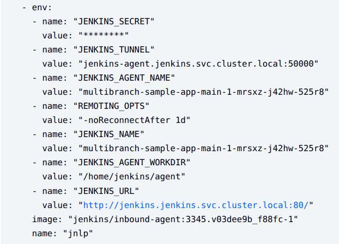

## 目的

在上一篇『[Jenkins：安裝 Jenkins 在 Kubernetes](https://wcya.github.io/hugo-papermod-blog/posts/jenkins/install)』將 Jenkins 安裝在 Kubernetes 後，現在來試試看搭配 GitHub 去使用 [Multibranch Pipelines](https://www.jenkins.io/doc/book/using/best-practices/#use-multibranch-pipelines) 自動化管理 Pipeline Jobs。

## Dynamic Agents

透過 Helm Chart 安裝 Jenkins 時，預設會安裝 [Kubernetes Plugin](https://plugins.jenkins.io/kubernetes/)，可以在 Kubernetes Cluster 內動態的為 Jenkins agents 建立 Pod 而不用手動去建立 static agents。

## 事前準備

架構連線的方式為 GitHub App 在發生 events 時會送請求到 Jenkins Webhook，由於我的 Kubernetes Cluster 是在我的 Lab 環境，且沒有固定的外部 IP Addresses 或 Domain Names，這邊我使用 [Hookdeck](https://hookdeck.com/) 的 CLI 工具將來自 GitHub App 的 events 轉送往我 Kubernetes Lab 環境為 Jenkins 建立的 External IP。

在申請完 Hookdeck 帳號後，網站會引導你建立第一個 Connection，需要填的資訊約如下：

**👉 Event Source**

- Source Type：`GitHub`
- Source Name：自訂
- Webhook Signing Secret：自訂
  - `Webhook Signing Secret` 為用來驗證 Requests 是來自 GitHub App 的，所以此 Secret 需要設定在三個地方 `GitHub App`、`Hookdeck`、`Jenkins`，這邊我使用以下指令產生 secret：

    ```bash
    openssl rand -hex 32
    ```

**👉 Send requests to Hookdeck**

這部份可複製 Hookdeck 為你產生的 URL

**👉 Define your event destination**

- Destination Type：`CLI`
- Destination Name：自訂
- CLI Path：`/github-webhook/`
  - 為 `GitHub Branch Source` Plugin 使用的 URL Path

**👉 Install the Hookdeck CLI**

安裝好 CLI 工具並登入後，使用以下指令建立 CLI connection，之後送往 Hookdeck URL 的 events 都會轉發到你的 Jenkins URL：

```bash
# ./hookdeck listen {Your Jenkins URL} github
# 我的 Jenkins IP 為 172.18.8.202
./hookdeck listen http://172.18.8.202 github
```

## 建立 GitHub App

可參考官網附上的影片 [How to Create a GitHub Branch Source Multibranch Pipeline in Jenkins](https://www.youtube.com/watch?v=aDmeeVDrp0o)。

1. GitHub 點選右上角頭像，從下拉選單按 `Settings`
2. 左側欄點選 `Developer settings`
3. 點選 `New GitHub App`，之後輸入以下資訊
   - GitHub App name：`自訂`
   - Homepage URL：可自訂，主要用來介紹這個 App
   - Webhook URL：貼上從 Hookdeck 複製來的 URL
   - Webhook secret：貼上和 Hookdeck 設定一樣的 secret
   - Repository permissions：
     - Administration：`Read-only`
     - Checks：`Read and write`
     - Commit statuses：`Read and write`
     - Contents：`Read-only`
     - Metadata：`Read-only`
     - Pull requests：`Read-only`
   - Subscribe to events：
     - Check run
     - Check suite
     - Pull request
     - Push
     - Repository
4. 建立 GitHub App 成功後，在 General 頁面到 Private Keys 的部份去產生 private key 並下載
   - 但下載的 private key 是 `PKCS#1 RSAPrivateKey` 格式，Jenkins 的 Credential 必須使用 PKCS#8 格式，可透過以下指令轉換
   ```bash
   openssl pkcs8 -topk8 -nocrypt -in downloaded-private-key.pem -out private-key-pk8.pem
   ```
5. 最後將 GitHub App 安裝到某帳號的 repositories，左側欄點選 `Install App` > 點選自己的帳號，可選擇要全部 repositories 或選定特定的
   - 例如我這邊選擇這個 repo：[multipbranch-sample-app](https://github.com/WCYa/multibranch-sample-app)

## 設定 Jenkins

1. 在設定之前需要確認安裝了 [GitHub Branch Source Plugin](https://plugins.jenkins.io/github-branch-source/)
2. 設定 `Webhook Signing Secret`，用來驗證請求來源是來自 GitHub App
   1. 於 Jenkins 點選 `Manage Jenkins` > `Credentials`
   2. Domains `global` > `Add credentials`
      - Kind：`Secret text`
      - Secret：貼上和 Hookdeck 設定一樣的 secret
      - ID：自訂，例如 `github-webhook-secret`
   3. 於 Jenkins 點選 `Manage Jenkins` > `System`
   4. 滑動到 `GitHub` 的部份，點選 `Advanced`，再點選 `Add shared secret`
   5. Shared secret 選擇剛剛建立的 Credential(Secret text)
3. 設定 `Private Key`，確認 Jenkins 能正常連線使用 GitHub App
   1. 於 Jenkins 點選 `Manage Jenkins` > `Credentials`
   2. Domains `global` > `Add credentials`
      - Kind：`GitHub App`
      - ID：自訂，例如 `github-private-key`
      - App ID：從 GitHub App 複製
      - Key：貼上剛剛轉檔過後的 PKCS#8 private key
   3. 可以點選 `Text Connection` 測試
4. 開始建立 Multibranch Pipeline
   1. 到 Jenkins 首頁，點選 `New Item`
   2. Enter an item name：自訂，例如 `multibranch-sample-app`
   3. 選擇 `Multibranch Pipeline`
   4. Branch Sources：`GitHub`
   5. Credentials：選擇剛剛建立的 private key `github-private-key`
   6. Repository HTTPS URL：GitHub repository url，例如 `https://github.com/WCYa/multibranch-sample-app.git`

## 產生 Jobs 和 Builds

如果 GitHub repo 的 root 目錄沒有檔案 `Jenkinsfile`，此時 Jenkins `Multibranch Pipeline` 就還會是空的。

我們先從 GitHub branch `main` 建立檔案 `Jenkinsfile`，以下為從 [kubernetes-plugin
/examples](https://github.com/jenkinsci/kubernetes-plugin/tree/master/examples) 複製來的 Declarative Pipeline Script：

```groovy
// Uses Declarative syntax to run commands inside a container.
pipeline {
    agent {
        kubernetes {
            // Rather than inline YAML, in a multibranch Pipeline you could use: yamlFile 'jenkins-pod.yaml'
            // Or, to avoid YAML:
            // containerTemplate {
            //     name 'shell'
            //     image 'ubuntu'
            //     command 'sleep'
            //     args 'infinity'
            // }
            yaml '''
apiVersion: v1
kind: Pod
spec:
  containers:
  - name: shell
    image: ubuntu
    command:
    - sleep
    args:
    - infinity
    securityContext:
      # ubuntu runs as root by default, it is recommended or even mandatory in some environments (such as pod security admission "restricted") to run as a non-root user.
      runAsUser: 1000
'''
            // Can also wrap individual steps:
            // container('shell') {
            //     sh 'hostname'
            // }
            defaultContainer 'shell'
            retries 2
        }
    }
    stages {
        stage('Main') {
            steps {
                sh 'hostname'
            }
        }
    }
}
```

Push commit 到 branch `main` 後，GitHub App 就會發 Request 到 Jenkins Webhook，Jenkins 就會建立對應 branch `main` 的 job 並依照 `Jenkinsfile` 運行 build，可以從 `Console Output` 看到目前運行的資訊：


也可以從資訊看到，Jenkins Dynamic Agents 建立的 Pod 都會插入一個預設的 container 叫 `jnlp`，是 agents 用來向 Jenkins Controller 溝通使用，包含了一些敏感資訊：



所以不建議在 `jnlp` container 去運行 build，要如上述 example 一樣另外建立名稱為 `shell` 的 container 去運行 build，Kubernetes 在 manifest 內為 container 設定的環境變數，與同個 Pod 內的其他 container 的環境變數是相互隔離的。

讓我們另外建立一個 branch `fix-123` 並調整 `Jenkinsfile` 去撈取 `jnlp` container 的環境變數試試看：

```groovy
// Uses Declarative syntax to run commands inside a container.
pipeline {
    agent {
        kubernetes {
            // Rather than inline YAML, in a multibranch Pipeline you could use: yamlFile 'jenkins-pod.yaml'
            // Or, to avoid YAML:
            // containerTemplate {
            //     name 'shell'
            //     image 'ubuntu'
            //     command 'sleep'
            //     args 'infinity'
            // }
            yaml '''
apiVersion: v1
kind: Pod
spec:
  containers:
  - name: shell
    image: ubuntu
    command:
    - sleep
    args:
    - infinity
    env:
      - name: "CONTAINER"
        value: "shell"
    securityContext:
      # ubuntu runs as root by default, it is recommended or even mandatory in some environments (such as pod security admission "restricted") to run as a non-root user.
      runAsUser: 1000
'''
            // Can also wrap individual steps:
            // container('shell') {
            //     sh 'hostname'
            // }
            defaultContainer 'shell'
            retries 2
        }
    }
    stages {
        stage('Main') {
            steps {
                sh '''
                    hostname
                    echo "$CONTAINER"
                    # try to get JENKINS_SECRET env
                    echo "$JENKINS_SECRET"
                '''
            }
        }
        stage('for the fix branch') {
            when {
                branch "fix-*"
            }
            steps {
                sh '''
                    cat README.md
                '''
            }
        }
        stage('for the PR') {
            when {
                branch "PR-*"
            }
            steps {
                echo 'this only runs for the PRs'
            }
        }
    }
}
```

Push commit 到 GitHub 後，Jenkins 建立對應的 job `fix-123` 並運行 build，查看 `Console Output` 資訊可以發現在 `shell` container 是無法取得 `jnlp` container 的環境變數的：


